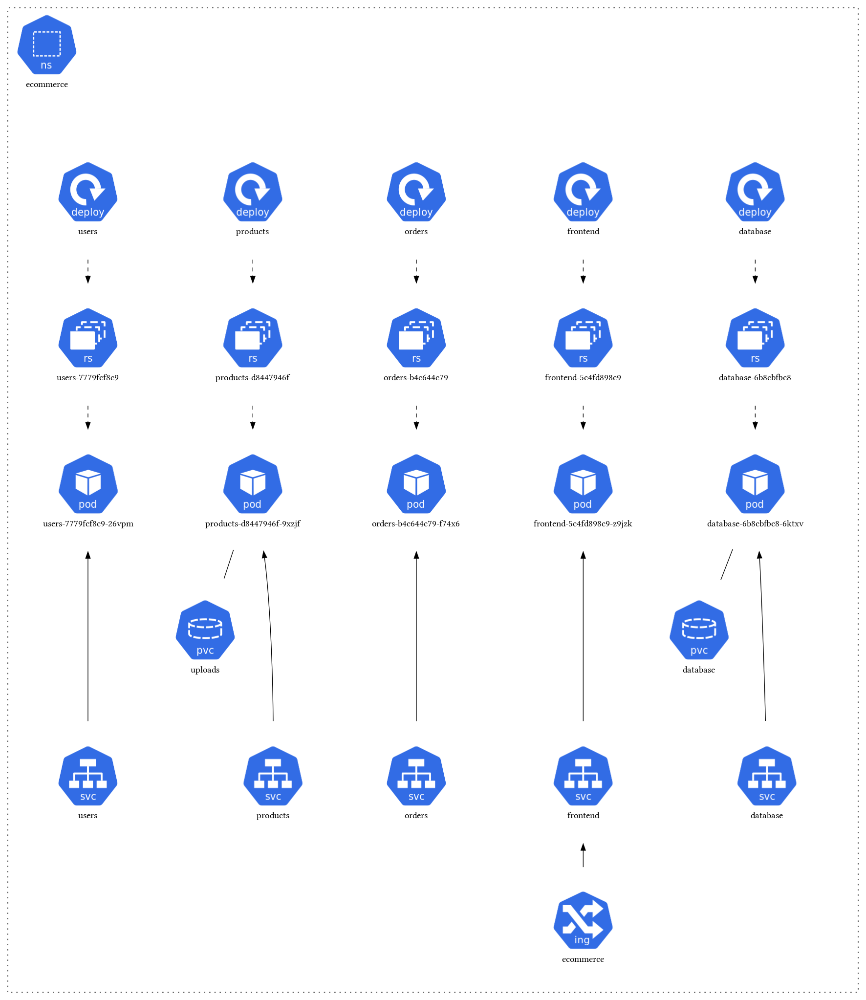

# Mern ecommerce - microservices - kubernetes.

Hello world,

The following app relates to my graduation project 
for bachelor's degree in systems engineering (Universidad Hispanoamerica) Costa Rica.


## Documentation

The application has been designed using the following technologies:

- MongoDB
- ExpressJS
- ReactJS
- NodeJS
- Kubernetes
- Docker
- Microservices

Basically, I created 3 microservices: Users, Products, Orders.
The services use REST to handle business logic, also,
I've used RabbitMQ to comunicate services, and MongoDB for the database.

I will be adding more features as I'm moving the project from 
docker-compose to kubernetes.

## Diagram


## Installation

```bash
# OPTIONAL: If you are running WSL and kubernetes (docker desktop) run the following:
# Local dev only:
mkdir /mnt/wsl/project-name
sudo mount --bind project-name-path /mnt/wsl/project-name

# Create docker images:
declare -a images
images=("users" "products" "orders" "email")

for image in ${images[@]}; do
  echo "Building microservices image: $image"
  docker build --no-cache -t "${image}:ecommerce" ./"ms-$image" 

  [[ $? -ne 0 ]] && echo "Build failed for: $image"
done

docker build --no-cache -t "frontend:ecommerce" ./frontend

# Copy and paste the following output
# into MONGO_URI value: kubernetes/secrets.yaml 
echo -n mongodb://database:27017/ecommerce?directConnection=true | base64

# Same for JWT_SECRET
echo -n SECRET | base64

# Create kubernetes namespace:
kubectl create namespace ecommerce

# Apply deployments and secret:
for deployment in $(find .); do
  echo "Applying deployment: ${deployment}"
  kubectl apply -f $deployment;
done

# Once we apply everything it should look like this:
k get all -n ecommerce
NAME                            READY   STATUS    RESTARTS      AGE
pod/database-5cc66d4455-kgxjw   1/1     Running   0             22h
pod/frontend-588965cd9c-6kxfl   1/1     Running   0             11s
pod/orders-7dd886f588-pcslh     1/1     Running   0             21h
pod/products-7f8b898888-pdptb   1/1     Running   0             87m
pod/users-59d995fcbc-lmhp5      1/1     Running   0             21h

NAME               TYPE        CLUSTER-IP       EXTERNAL-IP   PORT(S)     AGE
service/database   ClusterIP   10.108.53.93     <none>        27017/TCP   22h
service/frontend   ClusterIP   10.100.152.222   <none>        80/TCP      21m
service/orders     ClusterIP   10.101.163.220   <none>        8004/TCP    22h
service/products   ClusterIP   10.107.190.167   <none>        8003/TCP    22h
service/users      ClusterIP   10.107.211.84    <none>        8002/TCP    22h

NAME                       READY   UP-TO-DATE   AVAILABLE   AGE
deployment.apps/database   1/1     1            1           22h
deployment.apps/frontend   1/1     1            1           21m
deployment.apps/orders     1/1     1            1           22h
deployment.apps/products   1/1     1            1           22h
deployment.apps/users      1/1     1            1           22h

NAME                                  DESIRED   CURRENT   READY   AGE
replicaset.apps/database-5cc66d4455   1         1         1       22h
replicaset.apps/frontend-588965cd9c   1         1         1       11s
replicaset.apps/frontend-6c754c687b   0         0         0       10m
replicaset.apps/orders-7dd886f588     1         1         1       21h
replicaset.apps/products-7f8b898888   1         1         1       87m
replicaset.apps/users-59d995fcbc      1         1         1       21h

# In case of connecting to mongo:
kubectl port-forward $(kubectl get pod -n ecommerce | egrep -Eo 'database-(\w+\-)\w+') -n ecommerce 27017:27017
```

## Contributing

Contributions are always welcome!


## License

[MIT](https://choosealicense.com/licenses/mit/)


